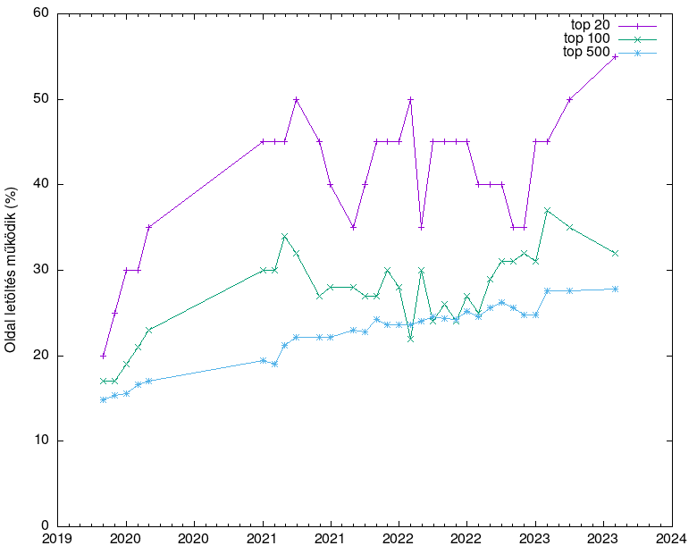

# Magyar web IPv6 használat

Hány weboldal támogat IPv6-ot a top 20/100/500 magyar oldalak közül?

A top 20/100/500 oldalak mindegyikén ellenőrizzük:
  * Van-e az oldalnak IPv6 címe a DNS szerint?
  * Sikerül-e az oldalt letölteni IPv6-on?
  * Van-e a domain-nek IPv6-on elérhető névszervere?

A top lista adatai a Gemius Audience-től származnak (gemius.com), minden havi eredmény az előző havi toplistán alapul.

# IPv6 támogatás időbeni változása



# Legutóbbi eredmény

Legutóbb frissítve: 2023 május

  * A magyar **top20** website közül:
    * IPv6 címe van: 50% (10)
    * Oldal letöltés működik IPv6-on: 50% (10)
    * DNS szerverének van IPv6 címe: 80% (16)

  * A magyar **top100** website közül:
    * IPv6 címe van: 37% (37)
    * Oldal letöltés működik IPv6-on: 35% (35)
    * DNS szerverének van IPv6 címe: 65% (65)

  * A magyar **top500** website közül:
    * IPv6 címe van: 28% (144)
    * Oldal letöltés működik IPv6-on: 27% (138)
    * DNS szerverének van IPv6 címe: 61% (309)

# Részletek

Részletes ereményekért nézd meg a file-okat a [results](https://github.com/atommaki/hungarian-web-ipv6/tree/master/results) mappában, formátum:
```
n;site;yes/no;yes/no;ns;ns6
```
 * n: a site helye a top500-as listán
 * site: a site neve
 * első yes/no: az oldalnak van/nincs IPv6 címe
 * második yes/no: az oldaletöltés működik IPv6-on
 * ns: az összes bejegyzett névszerverek száma
 * ns6: bejegyzett IPv6 névszerverek száma

